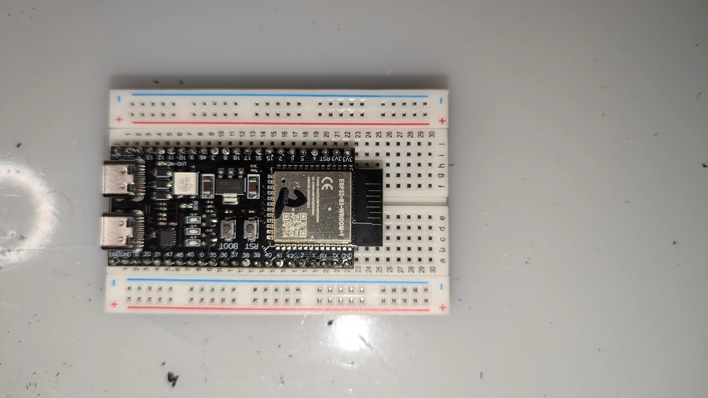

# Phase 1 Hardware Setup — Complete Beginner Guide

This guide assumes you have never touched electronics before. Follow every step in order. Do not skip ahead.

---

## What you have

- ESP32-S3-DevKitC-1 N16R8 board
- GY-521 MPU6050 IMU board (blue board with chip)
- BME280 barometer board
- Breadboard (840 tie points)
- Jumper wires (mixed bag)
- 10kΩ resistors
- USB-C cable

---

## Before you touch anything — read this

**Never connect or disconnect wires while the ESP32 is plugged into USB.** Always unplug USB first, make your wiring changes, double-check them, then plug USB back in. One wrong wire with power on can permanently destroy a chip.

**The ESP32 runs at 3.3V.** Every sensor in your kit is 3.3V compatible. Do not connect anything to the 5V pin — it exists but your sensors don't need it and it will damage the GY-521 and BME280.

---

## Step 1 — Understand the breadboard

Your breadboard looks like a grid of holes. Here is what is connected internally:

```
   ──────────────────────────────────────── ← red rail  (all connected, left to right)
   ──────────────────────────────────────── ← blue rail (all connected, left to right)

   a b c d e   f g h i j
1  · · · · ·   · · · · ·      ← row 1:  a1-b1-c1-d1-e1 are all connected
2  · · · · ·   · · · · ·      ← row 2:  f2-g2-h2-i2-j2 are all connected
3  · · · · ·   · · · · ·      (the gap in the middle separates left from right)
...
```

**The two long rails on the outside** (marked + and - or red and blue) run the full length of the board. Every hole in the red rail is connected to every other red hole. Same for blue. These are your power and ground highways.

**The short rows in the middle** are connected in groups of 5. Holes a1, b1, c1, d1, e1 are all connected to each other. Holes f1, g1, h1, i1, j1 are connected to each other. But e1 and f1 are NOT connected — the gap in the middle separates them.

**So when you push a chip's pin into row 14, any wire you push into another hole in row 14 on the same side is connected to that pin.**



---

## Step 2 — Place the ESP32

The ESP32-S3-DevKitC-1 is a long board with two rows of pins on each side. Place it lengthwise across the center gap of the breadboard so:
- The left pins go into columns a-e
- The right pins go into columns f-j
- The USB-C port hangs off one end of the breadboard

Push it down firmly and evenly. Every pin should be fully seated.

```
         USB-C port hangs off here
              ↓
    ┌─────────┤
    │ ESP32   │ ←── straddles the center gap
    └─────────┤
```

Now every ESP32 pin has one free hole next to it (on the same row, same side) where you can push a jumper wire.

---

## Step 3 — Set up the power rails

Find these two pins on the ESP32 (they are labeled on the board):

- **3V3** — this is 3.3V power output
- **GND** — this is ground (there are multiple GND pins, use any one)

**Wire 1:** Red jumper wire from the ESP32's 3V3 pin → red rail (+) on the breadboard  
**Wire 2:** Black jumper wire from the ESP32's GND pin → blue rail (-) on the breadboard

Now the red rail has 3.3V available and the blue rail is ground. Every component just needs to tap into these rails instead of running wires all the way back to the ESP32.

---

## Step 4 — Place and wire the GY-521 (MPU6050)

The GY-521 is a small blue board. It has a row of pins along one edge labeled:
```
VCC  GND  SCL  SDA  XDA  XCL  ADO  INT
```

You only need VCC, GND, SCL, SDA, and AD0.

Place the GY-521 somewhere on the breadboard away from the ESP32, with its pins in separate rows.

**Wire these 5 connections:**

| From | To | Wire color |
|---|---|---|
| GY-521 VCC | Red rail (+) | Red |
| GY-521 GND | Blue rail (-) | Black |
| GY-521 SDA | ESP32 GPIO 8 | Blue |
| GY-521 SCL | ESP32 GPIO 9 | Yellow |
| GY-521 AD0 | Blue rail (-) | Black or any color |

**Why AD0 to GND?** The AD0 pin sets the chip's I2C address. Tied to GND = address 0x68. Your `EspIMU.hpp` code looks for address 0x68. If you left AD0 floating (unconnected), it reads random values and the code won't find the chip.

---

## Step 5 — Place and wire the BME280

Your BME280 board has pins labeled:
```
VCC  GND  SCL  SDA  CSB  SDO
```

Place it on the breadboard in a free area away from the other chips.

**Wire these 5 connections:**

| From | To | Wire color |
|---|---|---|
| BME280 VCC | Red rail (+) | Red |
| BME280 GND | Blue rail (-) | Black |
| BME280 SDA | Same row as GY-521 SDA wire (GPIO 8) | Blue |
| BME280 SCL | Same row as GY-521 SCL wire (GPIO 9) | Yellow |
| BME280 SDO | Blue rail (-) | Black or any color |

**Important — sharing GPIO 8 and 9:** Both the GY-521 and BME280 connect SDA to GPIO 8 and SCL to GPIO 9. This is fine and intentional. I2C is a shared bus — multiple devices share the same two wires. The ESP32 talks to each chip by sending its address first (0x68 for the MPU6050, 0x76 for the BME280), like calling someone by name before speaking.

To connect both to GPIO 8: find the breadboard row where your first SDA wire lands on the GPIO 8 side. Push the second SDA wire into another free hole in the same row. They are now both connected to GPIO 8.

**Why SDO to GND?** Same idea as AD0 — it sets the I2C address to 0x76, which is what `EspBarometer.hpp` expects.

---

## Step 6 — The 10kΩ resistor (for the arm switch)

For Phase 1 desk testing you don't actually need the physical arm switch yet — your `MissionCommander` has `isArmPinHigh()` returning `true` automatically in simulation. **Skip this step for now and come back to it when you add the arm switch before real flights.**

For reference when you do need it: a pull-down resistor connects between the GPIO pin and GND. Without it, an unconnected GPIO pin floats and reads random HIGH/LOW values instead of a clean signal.

```
3.3V ── [switch] ── GPIO 34 ── [10kΩ resistor] ── GND

Switch open:  GPIO 34 pulled to 0V through resistor = reads LOW
Switch closed: 3.3V reaches GPIO 34 directly = reads HIGH
```

---

## Step 7 — Double check everything before powering on

Go through this checklist with the USB unplugged:

**Power rails:**
- [ ] Red wire from ESP32 3V3 → red rail
- [ ] Black wire from ESP32 GND → blue rail

**GY-521 (MPU6050):**
- [ ] VCC → red rail
- [ ] GND → blue rail
- [ ] SDA → GPIO 8
- [ ] SCL → GPIO 9
- [ ] AD0 → blue rail

**BME280:**
- [ ] VCC → red rail
- [ ] GND → blue rail
- [ ] SDA → GPIO 8 (same row as GY-521 SDA)
- [ ] SCL → GPIO 9 (same row as GY-521 SCL)
- [ ] SDO → blue rail

**Visual check:**
- [ ] No wires bridging across the center gap accidentally
- [ ] All chip pins fully seated (not halfway out)
- [ ] No bare wire ends touching each other

---

## Step 8 — Flash your firmware

With wiring checked, plug in the USB-C cable.

Open your terminal in the mapthefarm project folder and run:

```bash
pio run -e esp32s3 -t upload
```

You should see PlatformIO compile, then flash. It will print something like:

```
Uploading .pio/build/esp32s3/firmware.bin
Writing at 0x00001000... (100 %)
Hash of data verified.
```

If it fails with "could not open port" or "no device found":
- Try pressing and holding the BOOT button on the ESP32 while plugging in USB
- Try a different USB cable (some cables are charge-only and carry no data)
- Check that PlatformIO has permission to access the serial port on Mac (System Preferences → Privacy → Developer Tools)

---

## Step 9 — Open serial monitor and verify

After flashing, run:

```bash
pio device monitor --baud 115200
```

You should see output like this within a few seconds:

```
========================================================
         DRONE FLIGHT CONTROLLER (DUAL-CORE)
         Core 0: Avionics (20Hz) | Core 1: Flight (250Hz)
         Mass: 0.65kg  Arm: 120mm  Hover: 17% throttle
========================================================

[IMU] EspIMU (MPU6050) initialised on I2C
[IMU] Gyro bias: X=12.4 Y=-3.1 Z=0.8
[BARO] Calibrating ground reference — keep still...
[BARO] EspBarometer (BME280) initialised
[BARO] Ground reference: 101243.5 Pa
[ESC] EspESC (DShot600) initialised on GPIO 4/5/6/7
```

**If you see garbage characters** (random symbols): the baud rate is wrong. Try `--baud 9600` or `--baud 57600`.

**If the IMU line never appears**: check SDA/SCL wires. Most common mistake is swapping GPIO 8 and 9.

**If you see "Expected chip ID 0x60, got 0x00"**: the BME280 isn't communicating. Check VCC and GND first, then SDA/SCL.

---

## Step 10 — Test the sensors by hand

Once you see the initialisation messages, try these tests:

**IMU test:** Pick up the breadboard and tilt it. Watch the serial output — Roll° and Pitch° numbers should change as you tilt. If they don't move at all, your SDA/SCL wires to the GY-521 are wrong. If they move erratically, check AD0 is tied to GND.

**Barometer test:** Cup your hands around the BME280 chip and breathe warm air on it gently. The altitude reading should drift slightly (temperature affects pressure). For a bigger test: press your finger firmly over the chip to slightly increase local pressure — altitude should drop a small amount.

---

## What comes next

Once both sensors are confirmed working you are ready for Phase 2:

- Order the 4-in-1 ESC and motors
- Wire the ESC signal lines to GPIO 4/5/6/7
- Test motor spin without props attached
- Add the nRF24L01 radio module for manual control

Keep this breadboard setup intact — you'll reuse it as you add each new component.

---

## Quick reference — all connections at a glance

```
ESP32-S3 pin    →    destination
─────────────────────────────────────────
3V3             →    Red rail (+)
GND             →    Blue rail (-)
GPIO 8 (SDA)    →    GY-521 SDA  +  BME280 SDA
GPIO 9 (SCL)    →    GY-521 SCL  +  BME280 SCL

GY-521 VCC      →    Red rail
GY-521 GND      →    Blue rail
GY-521 AD0      →    Blue rail

BME280 VCC      →    Red rail
BME280 GND      →    Blue rail
BME280 SDO      →    Blue rail
```

Total wires: 12. Total chips on breadboard: 3 (ESP32, GY-521, BME280).